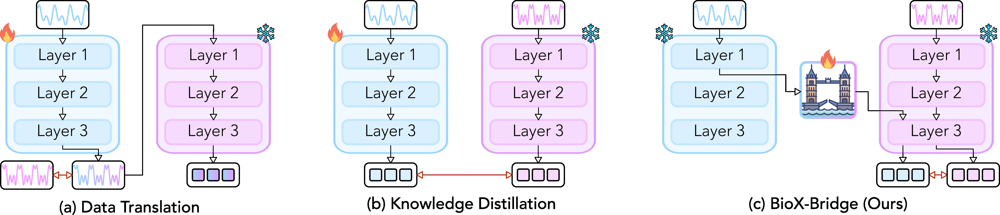
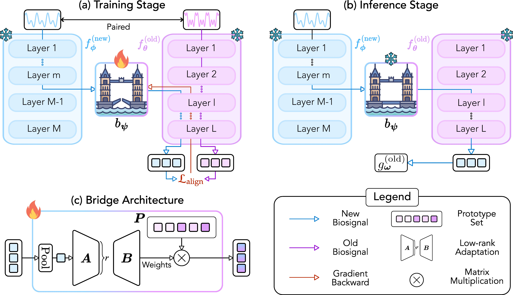

<div align="center">

# BioX-Bridge
*Model Bridging for Unsupervised Cross-Modal Knowledge Transfer across Biosignals*

[](https://arxiv.org/abs/2510.02276) 
[](https://openreview.net/forum?id=1448q0s3zZ)

</div>

This is the official implementation of BioX-Bridge: Model Bridging for Unsupervised Cross-Modal Knowledge Transfer across Biosignals



# Introduction

Biosignals offer valuable insights into the physiological states of the human body. Although biosignal modalities differ in functionality, signal fidelity, sensor comfort, and cost, they are often intercorrelated, reflecting the holistic and interconnected nature of human physiology. This opens up the possibility of performing the same tasks using alternative biosignal modalities, thereby improving the accessibility, usability, and adaptability of health monitoring systems. However, the limited availability of large labeled datasets presents challenges for training models tailored to specific tasks and modalities of interest. Unsupervised cross-modal knowledge transfer offers a promising solution by leveraging knowledge from an existing modality to support model training for a new modality. Existing methods are typically based on knowledge distillation, which requires running a teacher model alongside student model training, resulting in high computational and memory over- head. This challenge is further exacerbated by the recent development of foundation models that demonstrate superior performance and generalization across tasks at the cost of large model sizes. To this end, we explore a new framework for unsupervised cross-modal knowledge transfer of biosignals by training a lightweight bridge net- work to align the intermediate representations and enable information flow between foundation models and across modalities. Specifically, we introduce an efficient strategy for selecting alignment positions where the bridge should be constructed, along with a flexible prototype network as the bridge architecture. Extensive experiments across multiple biosignal modalities, tasks, and datasets show that BioX-Bridge reduces the number of trainable parameters by 88–99% while maintaining or even improving transfer performance compared to state-of-the-art methods.


# Requirements
1. Setup conda environment `conda env create -f environment.yml`
2. Activate environment `conda activate BioX-Bridge`

# Repository structure
```
bridge_code
├── bash_scripts                              (bash scripts for reproducing experiments)
├── dataset_preprocessing                     (preprocessing code for WESAD, ISRUC and FOG)
├── ECG_Classification_anonymous              (source code from ECG traditional model ECG-DualNet)
├── ECG_FM_anonymous                          (source code from ECG foundation model ECG-FM)
├── HuBERT_ECG_anonymous                      (source code from ECG foundation model HuBERT-ECG)
├── LaBraM_anonymous                          (source code from EEG foundation model LaBraM)
├── papagei_anonymous                         (source code from PPG foundation model PaPaGei)
├── NormWear_anonymous                        (source code from EMG foundation model NormWear)
├── bridge_position_selector_utils.py         (helper tools for calculating CKA)
├── bridge_position_selector.py               (bridge position selection code)
├── environment.yml                           (configuration for building conda environment)
├── train_bridge.py                           (main code for training bridge, storing features, evaluating)
└── utils.py                                  (helper tools)
```

# Data Preprocessing
1. Download WESAD https://ubi29.informatik.uni-siegen.de/usi/data_wesad.html
2. Download FOG https://data.mendeley.com/datasets/r8gmbtv7w2/3
3. Download ISRUC https://sleeptight.isr.uc.pt/?page_id=48
4. Go to data preprocessing directory `cd dataset_preprocessing`
5. Update `wesad_path` in `make_WESAD.py` and `fog_path` in `make_FOG.py` and `isruc_path` in `make_ISRUC.py`
6. Preprocess WESAD `python make_WESAD.py` and FOG `python make_FOG.py` and ISRUC `python make_ISRUC.py`

# Download foundation model checkpoints
1. Download `labram-base.pth` to `LaBraM_anonymous/checkpoints/` from https://github.com/935963004/LaBraM/tree/main/checkpoints
2. Download `hubert_ecg_small.pt` to `HuBERT_ECG_anonymous/code/checkpoint/` from https://huggingface.co/Edoardo-BS/HuBERT-ECG-SSL-Pretrained/tree/main
3. Download `papagei_s.pt` to `papagei_anonymous/weights/` from https://zenodo.org/records/13983110
4. Download `normwear_last_checkpoint-15470-correct.pth` to `NormWear_anonymous` from https://github.com/Mobile-Sensing-and-UbiComp-Laboratory/NormWear/releases/tag/v1.0.0-alpha

# Experiments
1. Bash scripts for each of the six knowledge transfer directions are available under `bash_scripts`.

# Note
1. All logs will be stored under `/users/anonymous/BioX-Bridge`
2. All checkpoints will be stored under `/data/anonymous/BioX-Bridge/`
3. Special thanks to the authors of ECG-FM, HuBERT-ECG, LaBraM, PaPaGei, ECG-DualNet, and NormWear that served as the building blocks for this repository.